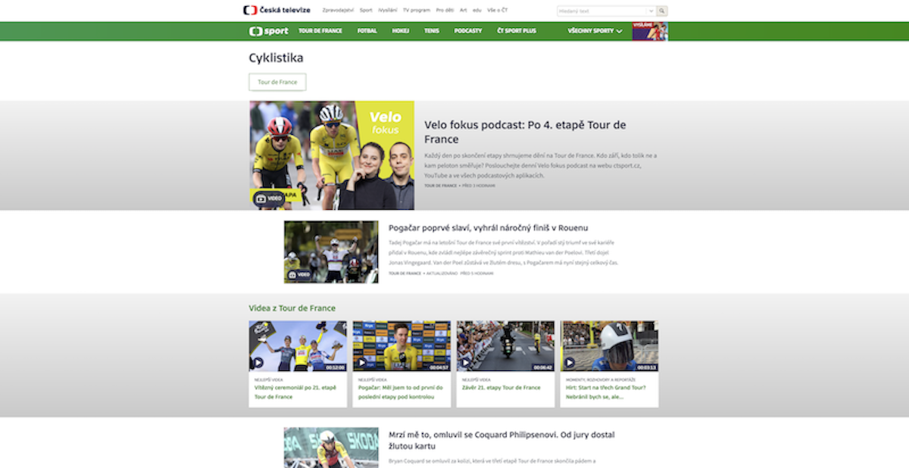

# ČT Sport – Zadání pro technické kolo pohovoru

## Úvod

Tento projekt obsahuje automatizované UI testy pro web ČT Sport (https://sport.ceskatelevize.cz/) napsané v jazyce TypeScript a frameworku Playwright.

## Technologický stack

- Playwright 1.53.2
- TypeScript 5.8.3
- Node.js 18.18.0

Projekt byl vyvinut a testován na Node.js v18.18.0, ale měl by fungovat i na vyšších verzích (např. Node 20/22). Pokud by byly potíže se spuštěním, dejte mi prosím vědět.

## Volba rubriky Cyklistika

V horním menu webu se aktuálně mění sportovní sekce podle sezóny (např. Tour de France). Aby byly testy robustní a udržitelné, volím cestu přes **"Všechny sporty" → "Cyklistika"**, která je stabilní a nezávislá na aktuálních událostech.


*Ukázka výsledné stránky rubriky **Cyklistika** (červenec 2025)*

## Strategie testů

### Test 1

- Otevřít rubriku **Cyklistika**.
- Ověřit, že všechny články v seznamu mají zobrazené datum.
- Najít první článek, který není video (podle absence štítku "VIDEO").
  - Poznámka: Pokud na stránce nejsou žádné ne-video články, test tuto situaci zaloguje a kontrolu ukončí.
- Otevřít tento článek.
- Ověřit, že článek obsahuje:
  - autora (v horní pravé části nad textem)
  - zdroj (ve spodní části článku)
- Najít sekci **Související články**.
- Ověřit, že první související článek je ze stejné rubriky (kontrola URL → obsahuje "/cyklistika/").

### Test 2

- Otevřít web při šířce viewportu pod 700 px (v tomto testu konkrétně 600x800).
- Ověřit, že se zobrazuje hamburger menu ("Rubriky").
- Kliknout na "Všechny sporty" a následně na "Cyklistika".
- Ověřit, že jsme přesměrováni do rubriky **Cyklistika** (kontrola URL obsahuje "/cyklistika").

## Poznámky k robustnosti

- Web ČT Sport je dynamický (články se mění, přibývají nové). Testy proto pracují s obecnými strukturami (např. kontrola přítomnosti data, nikoli konkrétní hodnoty).
- Kategorie „Cyklistika“ nemusí být v hlavním menu vždy viditelná (např. během Tour de France se nahrazuje jinou záložkou). Aby byl test stabilní a opakovatelný, používám přístup přes „Všechny sporty“, kde je „Cyklistika“ dostupná vždy.

**Limitace u článků:**  
Některé články (například živé přenosy – "Live" články) nemusí mít vyplněného autora nebo zdroj. Test aktuálně používá tvrdé kontroly (`expect(...).toBeVisible()`), což při kontrole těchto článků může způsobit selhání. Tento přístup odpovídá zadání ("Zkontrolujte, že má článek autora a zdroj"), ale v praxi by bylo vhodné případy live článků ošetřit dynamicky (např. detekovat typ článku a případně kontrolu autora/zdroje vynechat).

## Spuštění

```bash
npm install
npm test
```

Pro spuštění s otevřeným prohlížečem (headed mode):

```bash
npm test -- --headed
```
## Poznámky k ladění

- V průběhu vývoje jsem používal různé metody ladění přímo v kódu (např. pomocné funkce, `pause`, logy do terminálu). Tyto "debug" verze mám uložené lokálně.
- V této finální ("produkční") verzi nejsou aktivní žádné ladicí (`pause`, `highlight`, extra logy) kroky — kód je připravený na čistý a stabilní běh. V CI/CD prostředí by tak test neběžel zbytečně dlouho ani nezastavoval průběh.

**Příklady:**
```ts
// console.log(`Article ${i + 1}: ${title}`);
// await article.evaluate(el => el.style.outline = '3px solid green');
// await page.pause();
```